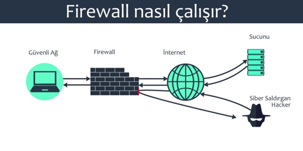
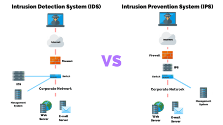

# Ağ Güvenliği Uygulamaları ve Araçları

Ağ güvenliği, bir ağdaki bilgisayarlar, veriler ve kaynaklara yetkisiz erişime, kullanıma veya değişime karşı korumayı sağlayan bir dizi politika, uygulama ve tekniktir.

### Yaygın Kullanılan Uygulamalar

1. **Firewall (Güvenlik Duvarı):** Ağa gelen ve ağdan çıkan trafiği denetleyen bir güvenlik duvarı, izinsiz erişimlere karşı koruma sağlar.

2. **Antivirüs Yazılımları:** Bilgisayar sistemlerini kötü amaçlı yazılımlardan korumak amacıyla kullanılan yazılımlardır. Virüs, trojan, solucan gibi zararlı yazılımları tespit eder ve temizler.

3. **Intrusion Detection System (IDS) ve Intrusion Prevention System (IPS):** IDS, ağdaki anormal aktiviteleri tespit ederken, IPS bu aktiviteleri önler. Bu sistemler, saldırıları tespit edip önlemeye yardımcı olur.

4. **VPN (Virtual Private Network):** Ağ üzerindeki iletişimi şifreleyerek güvenli bir bağlantı sağlar. Bu, uzaktan erişim veya açık ağlarda veri güvenliği için önemlidir.

5. **SSL/TLS Protokolleri:** Web trafiğini şifreleyen ve güvenli bir bağlantı sağlayan protokollerdir. Özellikle e-ticaret siteleri ve diğer hassas veri iletilen yerlerde kullanılır.

6. **Güçlü Parola ve Kimlik Doğrulama:** Kullanıcıların güçlü parolalar kullanmalarını ve çift faktörlü kimlik doğrulama gibi ek güvenlik önlemlerini uygulamalarını sağlar.

7. **Güvenlik Güncelleştirmeleri:** Sistem ve uygulamalardaki güvenlik açıklarını kapatmak için düzenli olarak güncelleştirmeleri takip etmek ve uygulamak önemlidir.

8. **Network Segmentation (Ağ Bölümlendirme):** Ağı farklı segmentlere bölmek, saldırıların yayılmasını sınırlayarak güvenliği artırabilir.

9. **Denial of Service (DoS) ve Distributed Denial of Service (DDoS) Koruması:** Ağa yönelik hizmet reddi saldırılarına karşı koruma sağlayan önlemler almak önemlidir.

10. **Eğitim ve Farkındalık Programları:** Kullanıcıları sosyal mühendislik saldırılarına karşı eğitmek ve bilinçlendirmek, güvenlik açısından önemlidir.

## Güvenlik Duvarları (Firewall)

Güvenlik duvarları (firewall), bir ağ ile diğer bir ağ arasında trafiği kontrol eden ve yetkisiz erişimi engelleyen yazılım veya donanımlardır. Güvenlik duvarları, ağ güvenliğinin temel taşıdır ve aşağıdaki gibi önemli işlevler sağlarlar:

1. **İzinsiz Erişim Engelleme:**
   - Güvenlik duvarları, ağa gelen ve ağdan çıkan trafiği denetleyerek izinsiz erişimleri engeller. Bu, yetkisiz kullanıcıların ağa zarar vermesini önler.

2. **Ağ Trafiği Kontrolü:**
   - Güvenlik duvarları, belirli portlardan gelen veya belirli protokolleri kullanan trafiği kontrol eder. Bu, belli başlı ağ saldırılarına karşı koruma sağlar.
   - DDoS saldırılarını engellemek için trafiğin yoğunluğunu ve kaynak kullanımını izleyebilir.

3. **Güvenlik Politikalarının Uygulanması:**
   - Güvenlik duvarları, organizasyonun belirlediği güvenlik politikalarını uygular. Bu, belirli uygulamalara veya içeriklere erişimi sınırlayarak güvenliği artırır.

## Intrusion Detection System (IDS) ve Intrusion Prevention System (IPS)

İzinsiz Giriş Tespit Sistemi (IDS) ve İzinsiz Giriş Önleme Sistemi (IPS) veya Giriş Denetimi Sistemleri/Giriş Koruma Sistemleri, ağ trafiğini izleyerek ve şüpheli aktiviteleri tespit ederek ağ güvenliğini sağlayan yazılım veya donanımlardır. IDS'ler, tespit ettikleri şüpheli aktiviteleri yöneticilere rapor ederken, IPS'ler ayrıca bu aktiviteleri engelleyebilir.

IDS/IPS'ler, aşağıdaki gibi önemli işlevler sağlarlar:

1. **Anomalilerin ve Saldırıların Tespiti (IDS):**
   - IDS, ağdaki anormal aktiviteleri tespit eder. Örneğin, belirli bir kullanıcının normalden farklı saatlerde yoğun veri transferi yapması gibi durumları algılar.

2. **Hızlı Tepki ve Önleme (IPS):**
   - IPS, IDS'nin tespit ettiği saldırılara otomatik olarak tepki verir ve saldırıları durdurur. Bu, saldırıların daha fazla zarar vermesini engeller.

3. **Günlük Tutma ve Analiz:**
   - IDS ve IPS, ağdaki aktivitelerle ilgili günlükleri tutar. Bu günlükler, saldırıları analiz etmek ve gelecekteki güvenlik önlemleri için kullanılmak üzere önemlidir.

## Antivirüs Yazılımları

Antivirüs yazılımları, bilgisayarlara ve ağlara bulaşan kötü amaçlı yazılımları tespit eden ve kaldıran yazılımlardır. Antivirüs yazılımları, aşağıdaki gibi önemli işlevler sağlarlar:

1. **Zararlı Yazılım Tespiti:**
   - Antivirüs yazılımları, bilgisayar sistemlerine bulaşmış olan virüsleri, trojanları, solucanları ve diğer zararlı yazılımları tespit eder.

2. **Sistem Temizleme ve Karantina:**
   - Zararlı yazılım tespit edildiğinde, antivirüs yazılımları bu yazılımları temizler veya karantinaya alır. Bu, sistemin temiz kalmasını sağlar.

3. **Güncel Tanımlar ve Veritabanları:**
   - Antivirüs yazılımları düzenli olarak güncellenen virüs tanımları ve veritabanları kullanır. Bu, yeni çıkan zararlı yazılımlara karşı koruma sağlar.

4. **Gerçek Zamanlı Koruma:**
   - Antivirüs yazılımları genellikle gerçek zamanlı koruma sağlar. Bu, kullanıcıların bilgisayarlarını kullanırken anında tehditlere karşı koruma demektir.

### Araçların Önemi

Ağ güvenliği açısından kullanılan çeşitli araçlar, ağları ve bilgisayarları çeşitli tehditlere karşı korumak için önemlidir:

- **Güvenlik Duvarları:**
  Güvenlik duvarları, ağ güvenliğinin temel taşıdır ve yetkisiz erişimi engellemek için çok önemlidir.

- **IDS/IPS (İzinsiz Giriş Tespit ve Önleme Sistemleri):**
  IDS/IPS'ler, saldırıları tespit etmek ve önlemek için önemlidir. Bu sistemler, ağ trafiğini izleyerek şüpheli aktiviteleri tespit eder ve hızlı bir şekilde tepki vererek saldırıları durdurabilir.

- **Antivirüs Yazılımları:**
  Antivirüs yazılımları, bilgisayarları ve ağları kötü amaçlı yazılımlardan korumak için önemlidir. Zararlı yazılım tespiti, temizleme ve güncel veritabanları ile bilgisayarları güvende tutar.

Bu araçları doğru bir şekilde kullanarak, ağınızı daha güvenli hale getirebilir ve siber saldırılara karşı etkili bir koruma sağlayabilirsiniz.

## Kriptografi ve Şifreleme

Kriptografi, verileri yetkisiz erişime karşı korumak için kullanılan bir dizi tekniktir. Bu teknikler, şifreleme ve şifre çözme işlemlerini kullanarak verileri anlamsız hale getirir, bu da verilerin yalnızca yetkili kişilerin okuyabilmesini sağlar.

## Şifreleme Araçları

Şifreleme araçları, kriptografiyi uygulamak için kullanılan yazılım veya donanımlardır. Bu araçlar, çeşitli algoritmalar kullanarak verileri şifrelemek ve şifresini çözmek için tasarlanmıştır.

Kriptografi ve şifreleme araçları, günlük hayatımızın birçok alanında kullanılmaktadır. Veri iletimi, online güvenlik, finansal işlemler ve iletişim gibi birçok alanda, bilgilerin gizliliğini ve bütürlüğünü sağlamak için bu teknolojilere güvenilmektedir.

## Kriptografinin Kullanımı

Kriptografi, çeşitli amaçlarla kullanılarak bilgi güvenliğini sağlar. İşte kriptografinin temel kullanım alanları:

1. **Gizlilik Sağlama:**
   - Kriptografi, verileri şifreleyerek gizli tutar. Bu, sadece yetkili kişilerin içeriği anlamalarına izin verir.

2. **Bütünlük Koruma:**
   - Kriptografik algoritmalar, veri bütünlüğünü sağlar. Bu, verilerin değiştirilmediğini ve güvenilir olduğunu doğrular.

3. **Kimlik Doğrulama:**
   - Kriptografik yöntemler, kullanıcıların veya sistemlerin kimliğini doğrulamak için kullanılır. Bu, yetkilendirilmemiş erişimleri önler.

4. **Güvenli İletişim:**
   - Kriptografi, verilerin güvenli bir şekilde iletilmesini sağlar. Özellikle açık ağlarda (örneğin, internet), verilerin şifrelenmesi önemlidir.

5. **Diğer Kriptografik Hedefler:**
   - Kriptografi, gizlilik, bütünlük ve kimlik doğrulama gibi temel hedeflerin yanı sıra, çeşitli diğer hedeflere de hizmet eder. Bu, veri gizleme, doğrulama, yetkilendirme ve non-repudiation (geri alınamazlık) gibi kavramları içerir.

## Şifreleme Araçlarının Kullanımı

Şifreleme araçları, farklı amaçlar için kullanılan yöntemlerle bilgi güvenliğini artırmak için kullanılır. İşte bazı şifreleme araçlarının kullanım alanları:

1. **Symmetric ve Asymmetric Şifreleme:**
   - **Symmetric Şifreleme:** Aynı anahtarın hem şifreleme hem de deşifreleme için kullanıldığı bir yöntemdir.
   - **Asymmetric Şifreleme:** Genel ve özel anahtarları kullanarak daha güvenli bir iletişim sağlar.

2. **SSL/TLS Protokolleri:**
   - Web tabanlı iletişimde kullanılan SSL/TLS protokoller, şifreleme kullanarak güvenli bağlantılar sağlar. Özellikle e-ticaret siteleri ve online bankacılık gibi alanlarda önemlidir.

3. **VPN (Virtual Private Network):**
   - VPN'ler, internet üzerinden güvenli bağlantılar sağlamak için şifreleme kullanır. Uzaktan erişim için güvenli bir kanal oluşturur.

4. **PGP (Pretty Good Privacy) ve GPG (GNU Privacy Guard):**
   - PGP ve GPG gibi araçlar, e-postaları şifrelemek ve dijital imzalar eklemek için kullanılır. Bu, e-posta iletişimini güvenli hale getirir.

5. **BitLocker ve FileVault:**
   - BitLocker (Windows) ve FileVault (Mac) gibi araçlar, disk şifreleme sağlayarak bilgisayarların fiziksel çalınma veya kaybolma durumunda verilerin güvenliğini artırır.

   

### Kriptografi ve Şifrelemenin Önemi

Kriptografi ve şifreleme, bilgi güvenliğini sağlamak ve çeşitli alanlarda önemli avantajlar sunmak için kullanılır:

1. **Gizliliği Koruma:**
   - Kriptografi, özellikle hassas veya kişisel verilerin korunmasında gizliliği sağlar. Bu, kullanıcıların özel bilgilerinin yetkisiz kişiler tarafından erişilmesini engeller.

2. **Veri Güvenliği Sağlama:**
   - Şifreleme, verilerin izinsiz erişime veya değişikliğe karşı korunmasını sağlar. Bu, verilerin güvenliğini artırır.

3. **Güvenli İletişim:**
   - İnternet üzerindeki iletişimde şifreleme kullanmak, verilerin güvenli bir şekilde iletilmesini sağlar. Özellikle kullanıcı adları, şifreler ve finansal bilgiler gibi hassas veriler için önemlidir.

4. **Kimlik Doğrulama ve Yetkilendirme:**
   - Kriptografi, kimlik doğrulama ve yetkilendirme süreçlerinde güvenliği artırarak yetkisiz erişimlere karşı koruma sağlar.

5. **Kamu Güvenliği ve Ulusal Güvenlik:**
   - Devlet ve kamu kurumları, kriptografiyi kullanarak hassas bilgileri korur ve ulusal güvenliği sağlamak için şifreleme teknolojilerini benimser.

6. **E-Commerce ve Online İşlemler:**
   - Kriptografi, e-ticaret siteleri ve online bankacılık gibi platformlarda güvenli ödeme işlemleri ve kişisel bilgilerin korunmasında kritik bir rol oynar.
