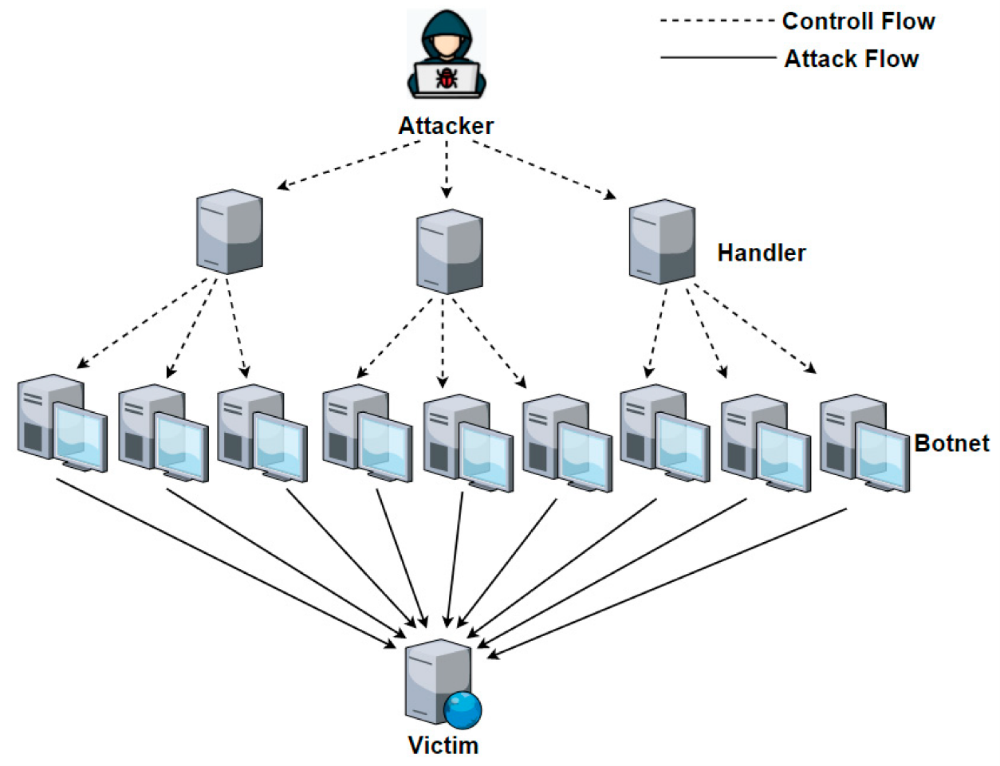

# Güncel Ağ Güvenliği Sorunları ve Çözümleri

Ağ güvenliği, bir organizasyonun veya bireyin bilgisayar ağı üzerindeki verilerini, sistemlerini ve iletişimini korumayı amaçlayan bir dizi önlemi içerir. Aşağıda, yaygın olarak karşılaşılan ağ güvenliği sorunlarından bazıları bulunmaktadır:

1. **DDoS Saldırıları (Dağıtılmış Hizmet Engelleme):**
   Ağa aşırı trafik gönderilerek servislerin çökmesine neden olan saldırılardır.

2. **Veri İhlalleri ve Sızıntılar:**
   Bilgisayar korsanlarının veya kötü niyetli iç kullanıcıların hassas verilere yetkisiz erişimi veya bu verileri sızdırması.

3. **Kötü Amaçlı Yazılımlar:**
   Virüsler, solucanlar, trojanlar, ransomware gibi zararlı yazılımların ağa bulaşması ve sistemlere zarar vermesi.

4. **Kimlik Avı (Phishing):**
   Kullanıcıları yanıltarak hassas bilgileri elde etmeye çalışan saldırılar. Sıklıkla sahte e-posta ve web siteleri kullanılır.

5. **İç Tehditler:**
   Kurum içindeki çalışanların, kasıtlı veya kasıtsız olarak güvenlik ihlallerine neden olması. Bu, bilgiyi kötüye kullanma, bilinçsizce güvenlik politikalarını ihlal etme gibi durumları içerir.

6. **Zayıf Şifre Güvenliği:**
   Güçlü olmayan şifrelerin kullanılması veya şifrelerin kötüye kullanılması sonucu oluşan güvenlik açıkları.

7. **Güncelleme İhmal Edilmesi:**
   Yazılım ve sistem güncellemelerinin yapılmaması, bilinen güvenlik açıklarının sömürülmesine olanak tanır.

8. **Ağ Cihazlarındaki Güvenlik Açıkları:**
   Routerlar, switch'ler, güvenlik duvarları gibi ağ cihazlarında bulunan yazılım veya konfigürasyon hataları.

9. **Nesnelerin İnterneti (IoT) Güvenliği:**
   Bağlı cihazların güvenlik açıkları, kötüye kullanılabilirlikleri ve bu cihazlar aracılığıyla ağa sızma tehlikeleri.

10. **Yapısal Zayıflıklar:**
    Ağ mimarisindeki hatalar, eksik güvenlik politikaları veya kötü konfigürasyonlar.

11. **Man-in-the-Middle Saldırıları:**
    İki taraf arasındaki iletişimi izinsiz olarak dinleme veya müdahale etme girişimleri.

12. **Güvenlik Politikalarının Eksikliği veya Yetersizliği:**
    Belirlenmiş güvenlik politikalarının olmaması veya yeterli olmaması, güvenlik açıklarına yol açabilir.

## DDoS Saldırıları

DDoS saldırıları, bir ağ veya web sitesini meşgul etmek ve hizmet dışı bırakmak için çok sayıda bilgisayardan veya cihazdan gelen sahte trafik dalgası kullanan bir tür siber saldırıdır. DDoS saldırıları, işletmeler, hükümetler ve bireyler için ciddi bir tehdit oluşturmaktadır.

### Güncel DDoS Saldırıları ile İlgili Sorunlar

1. **Artan Boyut ve Karmaşıklık:**
   - Geçmişte, DDoS saldırıları genellikle birkaç yüz veya bin cihazdan oluşuyordu. Ancak günümüzde, DDoS saldırıları yüz binlerce veya hatta milyonlarca cihazdan oluşabilir. Bu durum, saldırıların daha etkili ve daha zor engellenmesini sağlar.

2. **Hedef Çeşitlenmesi:**
   - DDoS saldırıları, işletmelerin web sitelerini, e-posta sunucularını ve diğer kritik altyapısını hedef almaktadır. Ancak günümüzde, DDoS saldırıları bireyleri, hükümetleri ve hatta kamu hizmetlerini de hedef almaktadır.

3. **Maliyetin Artması:**
   - DDoS saldırıları, işletmelere ve bireylere ciddi maddi zararlar verebilir. Bir DDoS saldırısı, işletmelerin gelir kaybına, itibar kaybına ve hatta iflas riskine yol açabilir.
   
   

## Veri İhlalleri

Veri ihlalleri, hassas bilgilerin yetkisiz kişiler tarafından ele geçirilmesi veya erişimidir. Veri ihlalleri, işletmeler, hükümetler ve bireyler için ciddi bir tehdit oluşturmaktadır.

### Güncel Veri İhlalleri ile İlgili Sorunlar

1. **Artan Boyut:**
   - Geçmişte, veri ihlalleri genellikle birkaç yüz veya bin kullanıcıyı etkilemekteydi. Ancak günümüzde, veri ihlalleri milyonlarca veya hatta milyarlarca kullanıcıyı etkileyebilir. Bu durum, veri ihlallerinin daha ciddi ve daha geniş kapsamlı etkilerine yol açmaktadır.

2. **Neden Çeşitlenmesi:**
   - Veri ihlalleri, genellikle yazılımdaki güvenlik açıklarından kaynaklanmaktadır. Ancak günümüzde, veri ihlalleri insan hatası, sosyal mühendislik ve hatta devlet müdahalesi gibi çeşitli nedenlerden kaynaklanabilmektedir.

3. **Maliyetin Artması:**
   - Veri ihlalleri, işletmelere ve bireylere ciddi maddi zararlar verebilir. Bir veri ihlali, işletmelerin gelir kaybına, itibar kaybına ve hatta iflas riskine yol açabilir.

   

## Diğer Güvenlik Tehditleri

DDoS saldırıları ve veri ihlalleri dışında, ağ güvenliğini tehdit eden birçok başka güvenlik tehdidi de bulunmaktadır.

### Güvenlik Tehditleri

1. **Kötü Amaçlı Yazılım:**
   - Kötü amaçlı yazılım, bilgisayar sistemlerine zarar vermek veya kontrol etmek için tasarlanmış yazılımdır. Ağ güvenliğini ihlal etmek için kullanılabilecek bir araçtır.

2. **Zero-day Saldırılar:**
   - Zero-day saldırılar, henüz bilinmeyen veya tam olarak düzeltilmemiş güvenlik açıklarından yararlanan saldırılardır. Ağ güvenliğini ihlal etmek için kullanılan en tehlikeli saldırı türlerinden biridir.

3. **Sanal Kimlik Avı:**
   - Sanal kimlik avı, kullanıcıları sahte web sitelerine veya e-postalara yönlendirerek kişisel bilgilerini ele geçirmek için kullanılan bir saldırı türüdür. Ağ güvenliğini ihlal etmek için kullanılan yaygın bir saldırı türüdür.

## Güvenlik Açıklarının Tespiti ve Kapatılması için En İyi Uygulamalar

Güvenlik açıklarının tespiti ve kapatılması, ağ güvenliğini sağlamak için kritik önem taşımaktadır. Güvenlik açıklarını tespit etmek ve kapatmak için kullanılabilecek çeşitli yöntemler vardır. 

### Güvenlik Açıkları Tespiti İçin Yöntemler

1. **Otomatik Güvenlik Taramaları:**
   - Otomatik güvenlik taramaları, ağdaki cihazları ve uygulamaları güvenlik açıkları için taramak için kullanılan yazılımlardır. Bu taramalar, güvenlik açıklarını otomatik olarak tespit edebilir ve raporlayabilir.

2. **Güvenlik Açıkları Veritabanları:**
   - Güvenlik açıkları veritabanları, bilinen güvenlik açıklarını içeren veritabanlarıdır. Bu veritabanları, ağdaki cihazlar ve uygulamalar için güvenlik açıklarını kontrol etmek için kullanılabilir.

3. **Güvenlik Uzmanları:**
   - Güvenlik uzmanları, ağdaki güvenlik açıklarını tespit etmek ve kapatmak için özel eğitime sahip profesyonellerdir.

### Güvenlik Açıkları Kapatma İçin Yöntemler

1. **Yamalar:**
   - Yamalar, güvenlik açıklarını kapatmak için kullanılan yazılım güncellemelerdir. Yamalar, güvenlik açıklarını kapatmak için en etkili yöntemdir.

2. **Yapılandırma Değişiklikleri:**
   - Yapılandırma değişiklikleri, ağdaki cihazların ve uygulamaların güvenlik ayarlarını değiştirmek için yapılan değişikliklerdir. Etkili bir yöntem olabilir.

3. **Yeni Cihaz ve Yazılımlar:**
   - Yeni cihaz ve yazılımlar, güvenlik açıkları içermez. Eski cihazları ve yazılımları yenileriyle değiştirmek, güvenlik açıklarını kapatmak için etkili bir yöntem olabilir.

## Ağ Güvenliğini Artırmak İçin Öneriler

- Güvenlik açıklarının tespiti ve kapatılması için düzenli olarak güvenlik taramaları gerçekleştirin.
- Güvenlik açıkları veritabanlarını takip edin ve ağdaki cihazlar ve uygulamalar için güvenlik açıklarını kontrol edin.
- Güvenlik uzmanlarına danışarak ağınızı düzenli olarak değerlendirin.
- Güvenlik politikası ve prosedürleri oluşturun ve bunları tüm çalışanlara uygulayın.
- Güçlü şifreler kullanın ve bunları düzenli olarak değiştirin.
- Yedekleme yapın ve düzenli olarak yedekleri test edin.

